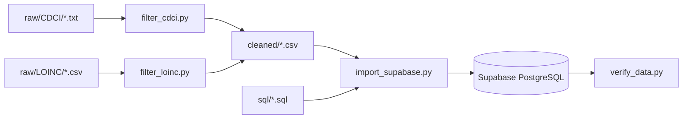

# Hospital Master Data Import Pipeline

Import CDCI (medicine), LOINC (investigation), and ICD-10 (diagnosis) datasets into Supabase PostgreSQL.

## Setup

```bash
pip install -r backend/import/requirements.txt

# Set env vars (or copy from .env.example)
export SUPABASE_DB_URL="postgresql://..."
export SUPABASE_URL="https://..."
export SUPABASE_SERVICE_ROLE_KEY="..."
```

## Pipeline Flow



## Commands

| Step | Command |
|------|---------|
| Filter CDCI | `python backend/import/scripts/filter_cdci.py` |
| Filter LOINC | `python backend/import/scripts/filter_loinc.py` |
| Run SQL only | `python backend/import/scripts/import_supabase.py --sql-only` |
| Import data | `python backend/import/scripts/import_supabase.py --data-only` |
| Full import | `python backend/import/scripts/import_supabase.py` |
| Verify | `python backend/import/scripts/verify_data.py` |

## All-in-one

```bash
cd backend/import
python scripts/filter_cdci.py && python scripts/filter_loinc.py && python scripts/import_supabase.py && python scripts/verify_data.py
```

## Source Data

| Dataset | Source | Tables |
|---------|--------|--------|
| CDCI | `raw/CDCI/*.txt` (tab-separated) | substance_master, generic_master, brand_master, product_master, drug_form_master, route_master, supplier_master |
| LOINC (active) | `raw/LOINC/LoincTable/Loinc.csv` + `raw/LOINC/AccessoryFiles/PartFile/Part.csv` | loinc_codes, loinc_parts |
| LOINC (future) | `raw/LOINC/AccessoryFiles/` | loinc_answer_list, loinc_answer_list_links, loinc_part_links (recreate DDL, run revert-future-tables.sql first if already exported) |
| ICD-10 | `raw/ICD10/` (future) | icd10_codes |

## Notes

- All duplicate rows use `ON CONFLICT DO NOTHING` — safe to re-run.
- `medicine_search` materialized view is auto-refreshed after CDCI import (run `REFRESH MATERIALIZED VIEW medicine_search;` after changes).
- pg_trgm extension required for trigram indexes. Enable with `CREATE EXTENSION IF NOT EXISTS pg_trgm;`.
- Raw and cleaned directories are gitignored.
